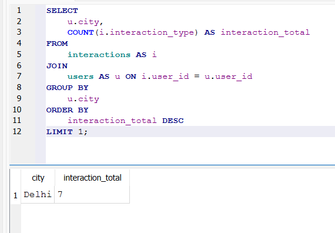

# 💰Marketing Campaign Analysis (SQL)

## 🎯Project Objective

To perform a diagnostic analysis of recent marketing campaign performance using SQL. The goal was to join data from multiple sources to segment users, evaluate campaign effectiveness, and identify the most valuable customer demographics (age group and city) based on interaction and conversion rates.

## Data Model & Sources

This analysis uses a relational model composed of three tables, loaded from the following CSV files:

- **Campaigns.csv** – Budget and date range for three active campaigns
    
- **Users.csv** – User demographic data (city and age group)
    
- **Interactions.csv** – Transactional events (View, Click, Conversion) linking users to campaigns
    

### 🗃️Table Schemas (DDL)

```sql
CREATE TABLE campaigns (
    campaign_id TEXT,
    campaign_name TEXT,
    start_date DATE,
    end_date DATE,
    budget INTEGER
);

CREATE TABLE users (
    user_id INTEGER,
    city TEXT,
    age_group TEXT
);

CREATE TABLE interactions (
    interaction_id INTEGER PRIMARY KEY,
    user_id INTEGER,
    campaign_id TEXT,
    interaction_type TEXT,
    interaction_date DATE
);

```
---

### 🔍 Analysis Queries (SQL)

The following six queries were executed to derive key performance and demographic insights:

#### Q1: Total interactions for 'Diwali Special' campaign?

```
SELECT
    COUNT(*)
FROM
    interactions
WHERE
    campaign_id = 'C2';
```

#### Q2: Which campaign had the most conversions? (Using Group By & Ordering)

```
SELECT
    campaign_id,
    COUNT(campaign_id) AS conversion_count
FROM
    interactions
WHERE
    interaction_type = 'Conversion'
GROUP BY
    campaign_id
ORDER BY
    conversion_count DESC
LIMIT 1;
```

#### Q3: Which age group generated the most conversions? (Using JOIN)

```
SELECT
    u.age_group,
    COUNT(i.interaction_id) AS conversion_count
FROM
    interactions AS i
JOIN
    users AS u ON i.user_id = u.user_id
WHERE
    i.interaction_type = 'Conversion'
GROUP BY
    u.age_group
ORDER BY
    conversion_count DESC
LIMIT 1;
```

#### Q4: Which city had the highest number of total interactions? (Using JOIN and Aggregation)

```
SELECT
    u.city,
    COUNT(i.interaction_type) AS interaction_total
FROM
    interactions AS i
JOIN
    users AS u ON i.user_id = u.user_id
GROUP BY
    u.city
ORDER BY
    interaction_total DESC
LIMIT 1;
```
---

---
#### Q5: Who are the top 3 most engaged users? (Using Join and Ordering)

```
SELECT
    u.user_id,
    COUNT(i.interaction_type) AS interaction_count
FROM
    interactions AS i
JOIN
    users AS u ON i.user_id = u.user_id
GROUP BY
    u.user_id
ORDER BY
    interaction_count DESC
LIMIT 3;
```

#### Q6: What was the conversion rate for the 'Diwali Special' campaign? (Using CTE and Aggregation)

```
WITH CampaignMetrics AS (
    SELECT
        SUM(CASE WHEN interaction_type = 'Click' THEN 1 ELSE 0 END) AS total_clicks,
        SUM(CASE WHEN interaction_type = 'Conversion' THEN 1 ELSE 0 END) AS total_conversions
    FROM
        interactions
    WHERE
        campaign_id = 'C2'
)
SELECT
    total_conversions * 1.0 / total_clicks AS conversion_rate
FROM
    CampaignMetrics;
```

## Key Business Insights

| Question                            | SQL Technique Used    | Key Insight / Result                               |
| ----------------------------------- | --------------------- | -------------------------------------------------- |
| Total 'Diwali Special' Interactions | COUNT(*)              | 8 total interactions (Views, Clicks, Conversions)  |
| Highest Converting Campaign         | GROUP BY, ORDER BY    | C2 (Diwali Special) generated the most conversions |
| Top Converting Age Group            | JOIN, GROUP BY        | The 26–35 age group drives the highest conversions |
| Highest Interaction City            | JOIN, GROUP BY        | Delhi recorded the highest volume of interactions  |
| Most Engaged Users                  | JOIN, ORDER BY, LIMIT | Users 101, 103, and 104 are the most engaged       |
| Diwali Special Conversion Rate      | CTE, CASE             | Conversion rate for C2 is **0.6 (60%)**            |
